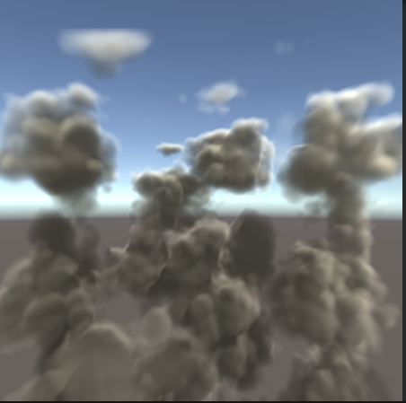
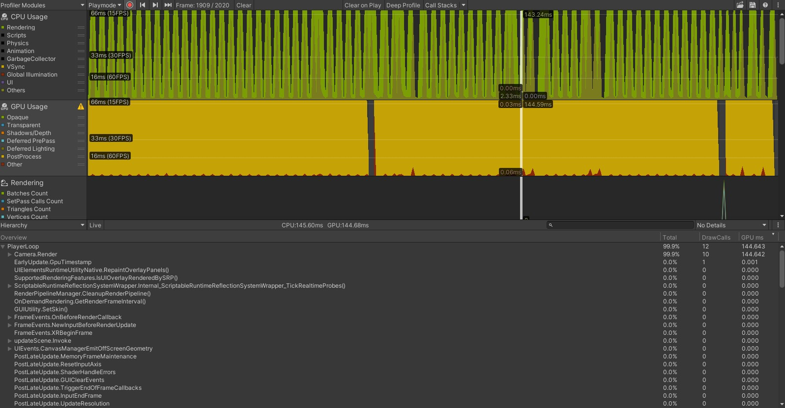
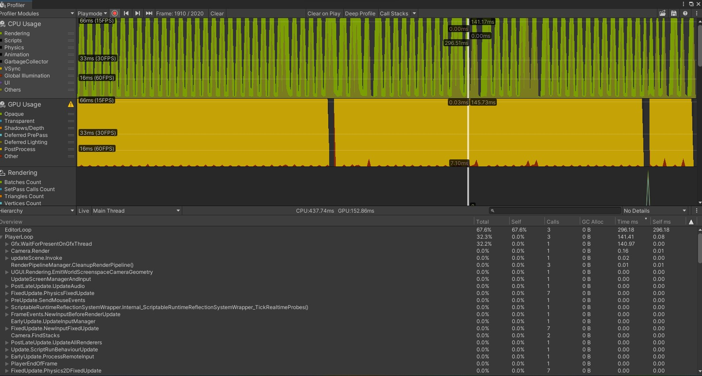

# Ray-Marching based clouds
## Non optimized apporach

Here is cloud system using ray marching. I use a compute shader to generate 3D texture using whorly noise and fractal brownian motion.
This determines the shape of the clouds. Once that is done, I sample the texture to determine the opicity and the lighting of the clouds
I calculate the in-scattering and shadows of the clouds by marching rays forward and sampling points inside a set volume. Shadow rays
are then sent toward the light source to determine how much light is rearching the current point. This allows for self shadowing
for the clouds, as seen below.

These rays are sent to every pixel on the screen. This combined with the shadow rays make the shader pretty exspensive.
GPU preformance below

CPU preformance below

As you can see, it is pretty slow. The ray marching shader needs to be optimized.